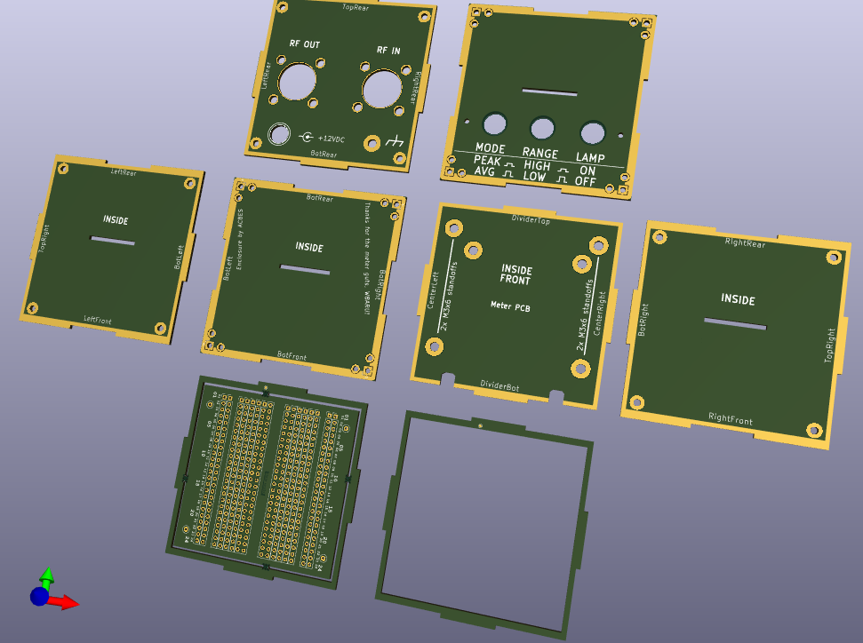

# An Enclosure for MFJ™ RF Power/SWR Meter Board Sets Using PCBs

     

## What is it?
- An enclosure for the MFJ-962C/986/989C RF power/SWR meter electronics.  
- The enclosure is a custom-designed set of 7 interlocking, nominally blank PCBs (i.e., there are holes and graphics, but there is no circuitry);  
  - design by AC8ES using [KiCAD](https://www.kicad.org/), [OpenSCAD](https://openscad.org/), [FreeCAD](https://www.freecad.org/), [boxes.py](https://boxes.hackerspace-bamberg.de/ABox?language=en), and [Inkscape](https://inkscape.org); 
  - minimally sized (72mm/3 inch cube) to contain the analog SWR meter, the two MFJ PCBs in each meter set, and two SO-239 connectors;  
  - PCB manufacture was deemed to be a low-cost method to create this many enclosures, and get consistent results;  
    - as a bonus, custom lettering and graphics are included!  
- __See docs/SWR-Meter_BOM-Assembly.ods for parts list and construction details__  

## Why
A member of our local amateur radio club had a couple dozen older MFJ board sets (without accompanying enclosures) to dispense with, and asked if I'd be willing to do something with them-- possibly a club build project.  

## Photos

   

   

   

Front of PCBs:  
  
Back of PCBs:  
  

## Files
See `docs/SWR-Meter_BOM-Assembly.ods` for parts list and construction details.  
The overall KiCAD project is in `KiCAD/swr_meter.kicad_pro`.  You can view all 7 pieces of the enclosure from here, _but "Gerber" files are generated from the KiCAD project specific to each piece_, such as `KiCAD/swr_meter_bottom.kicad_pro`.  
3D-printable pieces are `CAD/corner_block#3.FCStd` (`corner_block#3.stl`) and `CAD/switchLidv2.scad` (`switchLidv2.stl`).

## Authors

AC8ES 

## Version History

## License

This project is licensed under the [CERN Open Hardware Licence Version 2 - Weakly Reciprocal](https://choosealicense.com/licenses/cern-ohl-w-2.0/) - see the LICENSE.md file for details

(C)2024-2025, AC8ES

## Acknowledgments

* W8ARU supplied the MFJ board sets
* [KiCAD](https://www.kicad.org)
* [OpenSCAD](https://openscad.org)
* [FreeCAD](https://www.freecad.org)
* [boxes.py](https://boxes.hackerspace-bamberg.de/ABox?language=en)
* [Inkscape](https://inkscape.org)
* [JLC PCB](https://jlcpcb.com)

